

## Current Students

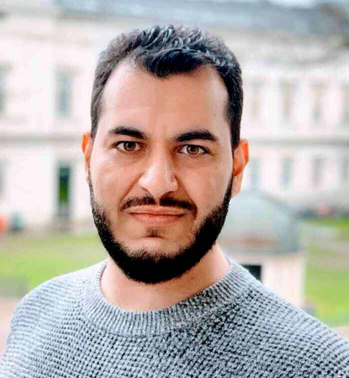
[**Antonis Papasavva**](https://antonispapasavva.github.io/)  
PhD Candidate  
University College London  
(since September 2019)  
 

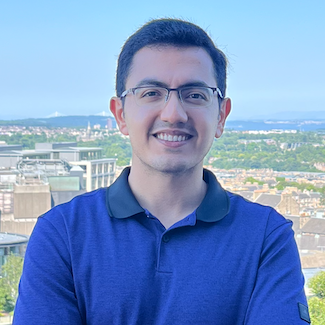
[**Mohammad Naseri**](https://mohammadnaseri.github.io/)  
PhD Candidate  
University College London  
(since September 2019)  
 

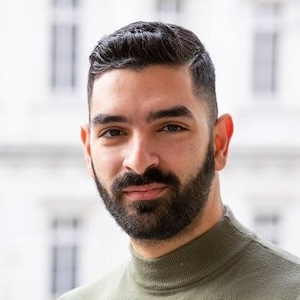
[**Alexandros Efstratiou**](https://alefstrat.github.io)  
PhD Candidate  
University College London  
(since September 2020)  
 

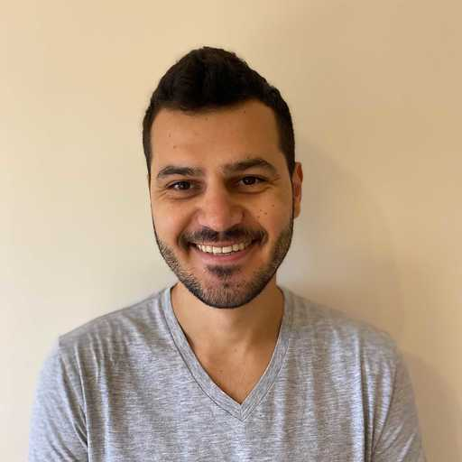
[**Georgi Ganev**](https://ganevgv.github.io/)  
PhD Student  
University College London  
(since October 2020, part-time)  
 

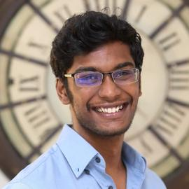
[**Meenatchi Sundaram Muthu Selva Annamalai (Sundar)**](https://msundarmsa.github.io)  
PhD Student  
University College London  
(since September 2022)  
 

[**Mohammad Reza Azimi**]()  
PhD Student  
University of California, Riverside  
(starting January 2024)  
 

## Past Students and Post-Docs

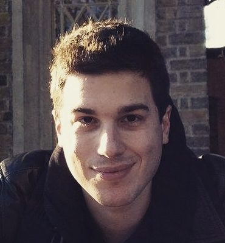
[**Alexandros Mittos**](https://mittos.xyz)  
PhD Alumnus   
Now Data Scientist at PS AI Labs  
Aug 2016 -- Oct 2020  
 

[**Apostolos Pyrgelis**](https://mex2meou.github.io)  
PhD Alumnus  
Now Senior Researcher at RISE Research Institutes of Sweden  
May 2015--Nov 2018  
 

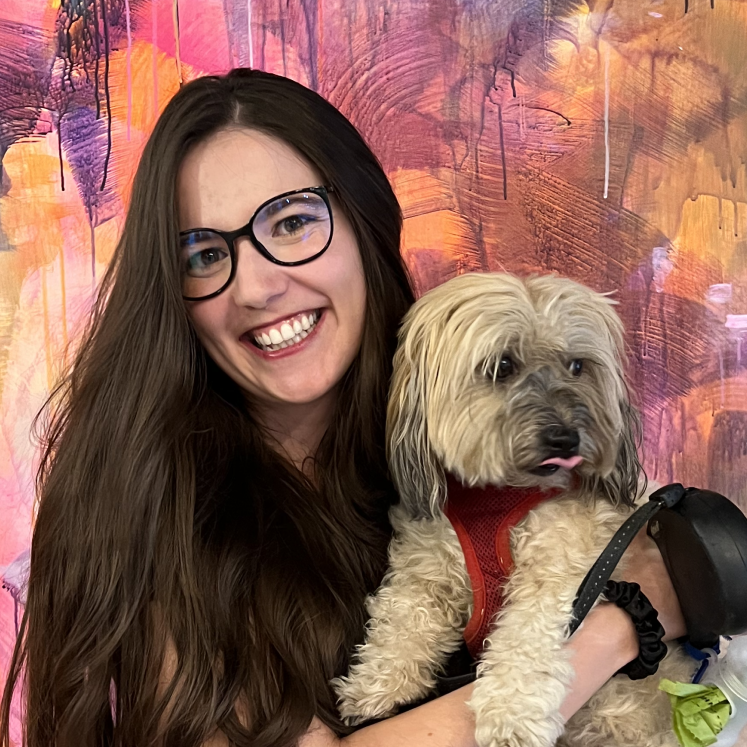
[**Bristena Oprisanu**](https://www.linkedin.com/in/maria-bristena-oprisanu-phd-61a5a35b)  
PhD Alumnus  
Now now ML Privacy Engineer at Bitfount  
Sep 2017 -- Jan 2021  
 

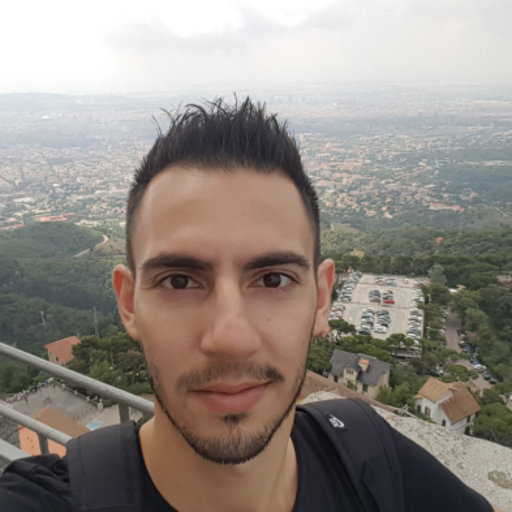
[**Kostantinos Papadamou**](https://kostantinospapadamou.com)  
Post-Doctoral Researcher  
University College London  
Nov 2022 -- Jun 2023  
 

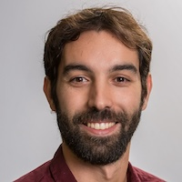
[**Luca Melis**](https://www.lucamel.is)  
PhD Alumnus  
Now Research Scientist at Meta  
Sep 2014 -- Aug 2018  
 

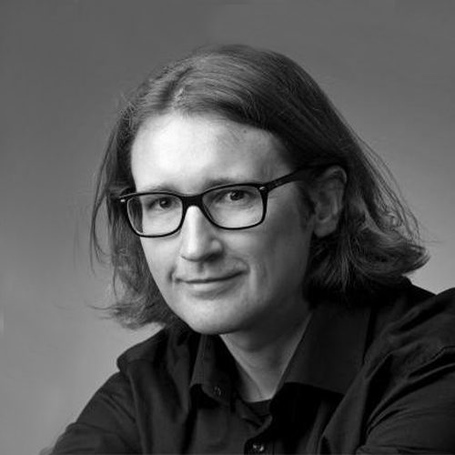
[**Lukasz Olejnik**](https://lukaszolejnik.com/)  
Post-Doctoral Researcher  
University College London  
Mar 2016 -- Mar 2017  
 

[**Lucky Onwuzurike**](https://luckenzo.github.io)  
PhD Alumnus  
Now Senior Cybersecurity Consultant at EY  
Sep 2014 -- Oct 2018  
 

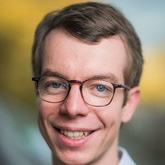
[**Vincent Primault**](http://www0.cs.ucl.ac.uk/staff/V.Primault/)  
Post-Doctoral Researcher  
University College London  
Dec 2017 -- Dec 2018  
 

## Co-Supervision
I have also been lucky to co-supervise/collaborate with a number of other students, including [Enrico Mariconti](http://www0.cs.ucl.ac.uk/staff/E.Mariconti/), [Despoina Chatzakou](http://oswinds.csd.auth.gr/people/despoina-chatzakou), [Jamie Hayes](http://www.homepages.ucl.ac.uk/~ucabaye/), [Andrea Cerulli](https://andreacerulli.github.io/), and [Savvas Zannettou](http://zsavvas.github.io).
